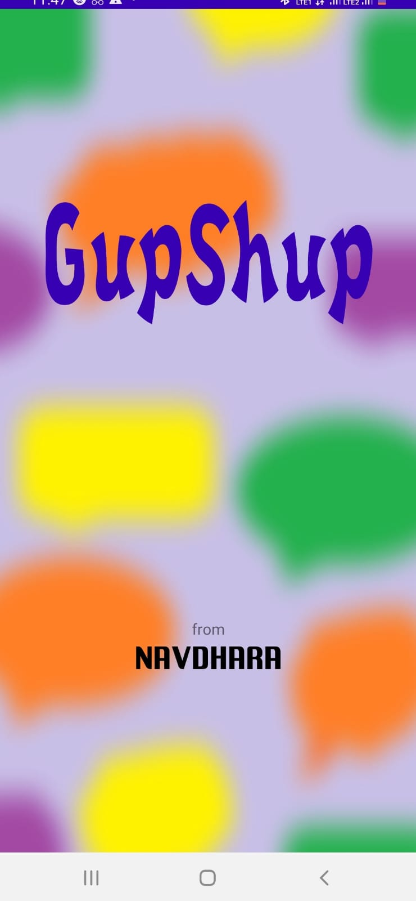

## GupShup: Online Chatting Application
Built on Android Studio (Language: Kotlin)

**Features** 
(1) One-to-One Text and Image Chatting facility  
(2) Profile Building (Profile Images, Cover Photo, Social Media Links)  
(3) Secure Chatting with Friends Only (Friend Request and Accept Feature)  
(4) Search Query (Search anyone on the app)  
(5) Google Firebase Authentication with Email Verification  
(6) Group Chatting (Create, Add and Chat with group members)  
